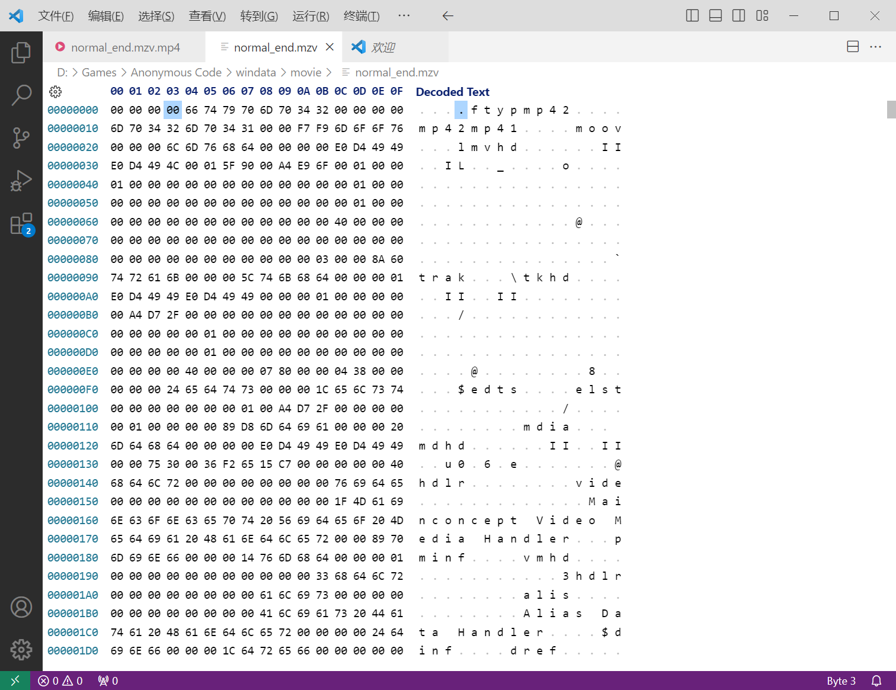
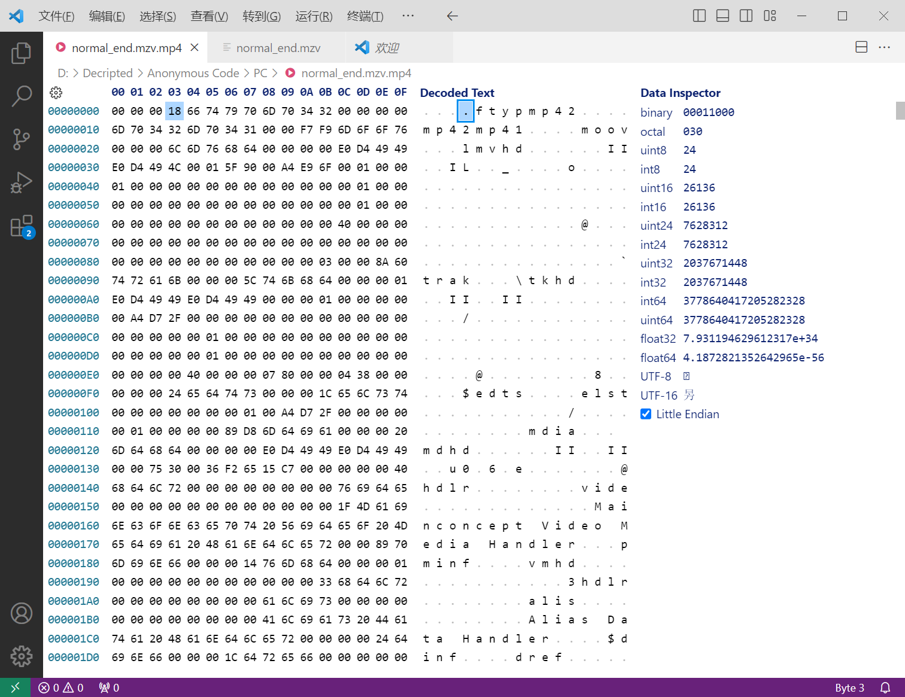

Anonymous Code PC Steam版的视频文件使用了mzv格式后缀名，实际上是文件头有问题的MP4文件，修改文件头前四个字节后改为mp4后缀即可正常播放。  
目前已经发现其中有至少三种MP4格式，需要修改为不同的值。  
文件固定开头为00~03位为00，04~07位为ftyp，再后面一段到moov或mdat之前是MP4封装格式。例如mormal_end.mzv的封装格式为mp42 (mp42/mp41) ，所以将第03位的00修改为0x18，即可正常播放。对应关系如下，需要严格对应每一个关键字。  
 - 0x18 mp42 (mp42/mp41)   
 - 0x1C mp42 (mp42/mp41/isom)   
 - 0x28 M4V  (M4V /M4A /mp42/mp41/isom/avc1)   
未出现但可能用到的对应关系  
 - 0x14 isom (isom)  
 - 0x1C isom (isom/iso2/mp41)   
 - 0x1C mp42 (mp42/isom/avc1)   
 - 0x1C mp42 (mp42/iso2/mp41)   
 - 0x20 mp42 (mp42/iso2/avc1/mp41)  
 - 0x20 isom (isom/iso2/avc1/mp41)  
  

