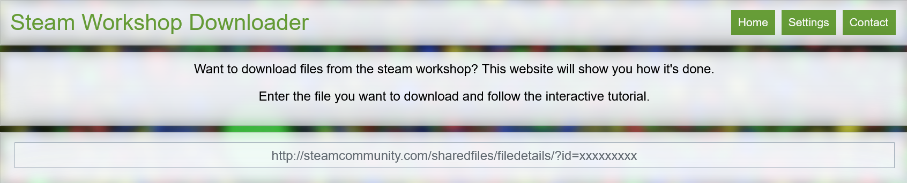
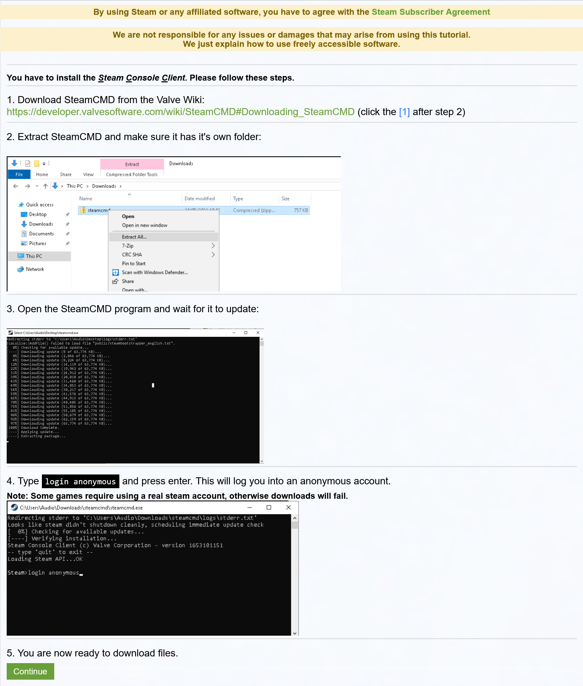
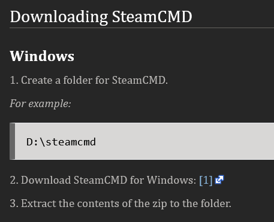
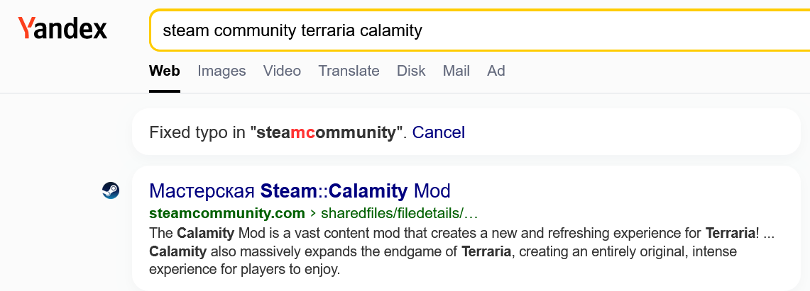
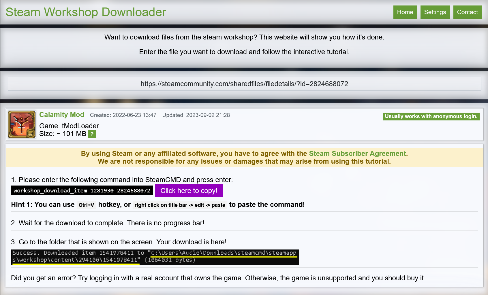

一个其实大部分情况下没屁用的攻略。其目的在于：不使用Steam账号，不使用加速器或科学网络工具，在拥有该游戏的情况下获取特定免费游戏的创意工坊文件。  
接下来以已经安装了GOG版的Terraria，获取tModLoader可用的Calamity（灾厄）模组创意工坊文件。  
首先在tmodLoader的[Github发布页](https://github.com/tModLoader/tModLoader)下载tModLoader的可执行文件，根据安装提示放在与Terraria安装目录同级的目录下。  
接下来访问[steamworkshopdownloader.io](https://steamworkshopdownloader.io/)，这是个第三方网站，并不直接提供下载，您也可以越过这段。根据其提示，访问[developer.valvesoftware.com](https://developer.valvesoftware.com/wiki/SteamCMD#Downloading_SteamCMD)，下载SteamCMD，并安装。  
  
  
  
接下来回到steamworkshopdownloader.io的输入框，根据其要求输入创意工坊页面链接。假设我们只知道模组名称，不知道具体页面链接，而我们的网络状况又不允许打开Steam搜索，需要用搜索引擎搜索。考虑到某度极其辣鸡，bing也开始对国区特殊对待，目前可以使用[yandex](https://yandex.com)搜索。关键字包括游戏名，模组名，steamcommunity。  
  
搜索得到创意工坊页面链接，粘贴回steamworkshopdownloader.io的输入框，获取到SteamCMD要用的指令。根据指令内容和模组链接逆推得到命令为'workshop_download_item'，第一个参数为Steam app id（1281930对应tModLoader），第二个参数对应模组页面id。找到此规律后可不使用此网站。  
  
最后打开SteamCMD，输入"login anonymous"登录，粘贴刚才得到的下载命令，执行，下载得到模组文件。  
然后关于游戏本身，就是打开SteamCMD下的\steamapps\workshop\content\\{appid\}\\{modid\}\目录，把.tmod文件复制到Documents\My Games\Terraria\tModLoader\Mods目录下，启动tModLoader了。  