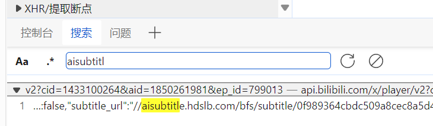

近期CC字幕工具失效，改为手动获取。  
## 准备
1. Edge浏览器，Firefox的搜索功能不知道为什么搜不到  
2. 安装TamperMonkey  
3. 安装脚本[解除B站区域限制](https://greasyfork.org/scripts/25718)，[Bilibili CC字幕工具](https://greasyfork.org/scripts/378513)（虽然没法直接使用，但需要挂载这个脚本才能刷出字幕链接）  
4. 安装Python，下载[bcc2ass](https://github.com/y2361547758/bcc2ass)  
## 开始
1. 浏览器登录账号，配置解除区域限制的脚本  
2. 打开该集番剧页面，按F12打开开发工具  
3. 点击下侧菜单栏中“控制台”按钮右侧的加号，添加并使用此处的“搜索”  
4. 搜索`aisubtitle.h`或`subtitle_url`，找到图中类似结果的一处链接，复制`aisubtitle.hdslb.com`后边这一串链接至结尾引号，至新标签页打开  

5. 保存该json文件至本地，或复制该页json的全部内容至本地文件  
6. 运行bcc2ass脚本，将json文件转换为srt字幕（转换为ass字幕似乎需要更多参数），指令：`bcc2ass.py -i input.json -o out`  