  
原文 待发布  
旧版原文发表于 [v2|cv22952557](https://www.bilibili.com/read/cv22952557/) [v1|cv10614833](https://www.bilibili.com/read/cv10614833/)，现对原文进行更新和更正。  
v3版本主要添加了PS2平台的游戏信息。  
Committee of Zero对MAGES引擎进行了较为详细的定义和描述，有兴趣可以阅读原文。  
[Committee of Zero|gitbooks.io](https://committeeofzero.gitbooks.io/mages-engine-compendium/content/)  
相关游戏数量越来越多，可能无法在文章中一一列举，可以查看我的在线表格查找相对完整的游戏-引擎对应关系。  
[OneDrive](https://1drv.ms/x/c/9b6ad7621ed2a4c0/EWhbExaTYg5Mk7zfboxqcakBEfUjW698YIjWbivFidvxWQ?e=bdT1Ei) 网页可能无法直接访问  

## 写在前面
不再赘述版权、软件安全等问题，请自行注意。  
本文旨在解析MAGES引擎的多媒体资源格式信息，此外也尽可能提供一些MAGES公司使用的其他引擎的信息。需要您有一定的计算机知识基础和动手能力。  
可能用到的一些运行时、通用依赖项：  
### .Net 5/6/7/8/9, .Net Core
目前推荐安装.Net 6 Desktop Runtime和.Net 8 Desktop Runtime这两个LTS版本。这几个版本之间的代码很容易升级，但软件需求的运行时版本在编译时已经决定，大多数情况下不能相互替代，请根据软件的要求安装对应的版本。  
### .Net Framework 4.6.1/4.7.2/4.8
完整安装的Win10系统应该自带4.8版本运行时，如没有请自行安装。4.8版本运行时可以运行包括4.5-4.8版本的软件。Win8、Win7系统需要安装一个指定系统更新后才能安装该运行时。注意，.Net Framework 与.Net Desktop是不同的运行时，不能互相替代。  
### Python3.x
推荐安装Python3.10及以上的版本，建议选择最新版。  
### pip依赖项
常用的依赖项有pillow，numpy，unrpa等，可在安装python后使用pip install命令安装。如果您需要多个python环境或遇到包版本冲突，请自行配置annaconda等环境工具。  
目前pillow 10.1.0版本的改动可能导致一些尝试引入图片格式的python脚本无法运行，如遇到此问题请查找该脚本的更新，或将pillow回滚至10.0.1版本。  
### Visual C++ Redistributable
建议安装最新的VC Redistributable（2015-2022）。Win10/Win11系统可以直接在Powershell使用指令“winget install Microsoft.VCRedist.2015+.x64”安装。部分C/C++程序可能要求旧版的VCRedist，如2012版，否则无法运行，需要另行安装。  
### 旧系统支持问题
根据一些软件的问题反馈，Github Runner和Visual Studio自2024年6月中的一次更新后所编译生成的程序可能无法在Windows7上运行。如果您仍在使用这个系统，请注意此问题，并根据自身情况选择更新系统或者使用2024年6月前的版本。  

## 通用处理逻辑
由GARbro处理外层的文件封包和图片格式转换，由VGMStream处理音频格式转换，由VGMToolBox处理视频解封装。  
以这三个软件作为最通用的工具，处理一般的没有额外加密的游戏就足够了。  
目前GARbro主分支虽偶有更新但很久没有发布release，仍能处理大部分MPK和CPK。如有其他需求、遇到问题或想自行编译推荐使用crskycode版本。  
GARbro个人维护版本迁移了仓库。我为个人维护版本和crskycode版本添加了自动构建脚本，如果您想要体验最新版的功能但不方便在本地构建，可以在登录Github账号后在对应仓库的 Actions 下找到对应的workflow，下载其中的ci-build版本的程序。根据仓库设置，这些内容会保留1-3个月不等。  
VGMStream只提供了命令行工具和网页版工具，且网页版工具有较多问题，如果需要用本地的图形化工具可以安装foobar2000播放器，配合VGMStream的插件版使用。  
VGMToolBox已长时间没有更新，目前仍能正确处理多数相关视频文件。  
个人维护的版本提供一点对相关游戏的额外支持，可能有bug。  
[GARbro(不推荐)|Github](https://github.com/morkt/GARbro) 需要DotNet Framework 4.6  
[GARbro-crskycode|Github](https://github.com/crskycode/GARbro) 需要DotNet Framework 4.6.1  
[GARbro 个人维护版本|Github](https://github.com/Manicsteiner/GARbro) 需要DotNet Framework 4.6.2  
[VGMStream](https://vgmstream.org/)  
[foobar2000](https://www.foobar2000.org/)  
[VGMToolBox|SourceForge](https://sourceforge.net/projects/vgmtoolbox/) 需要DotNet Framework 4.5  
[VGMToolBox 个人维护版本|Github](https://github.com/Manicsteiner/VGMToolbox) 需要DotNet Framework 4.8  

## MAGES引擎-PC端
主要游戏：命运石之门系列（Steam版），混沌之子，Yu-No 2017版，秋回8+FD，SinMemo（DMM版），机器人笔记+FD，秋回1-7（Steam版）  
特征：使用MPK或CPK格式进行封包，图片使用常见格式，音频使用OGG、ADX、HCA格式，视频使用USM、BK2等格式封装，立绘图片有一定程度的加密。  
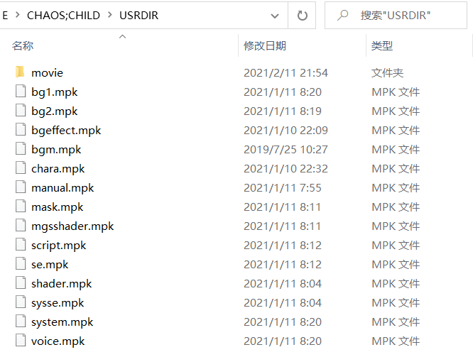  
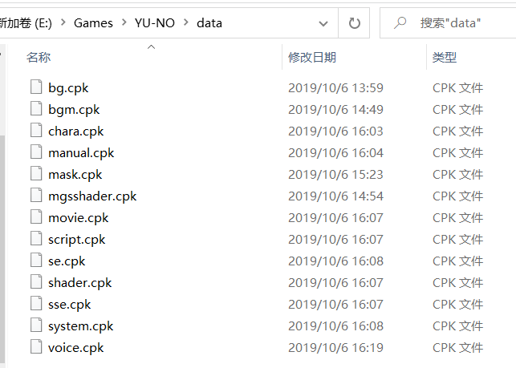  
解包方案：参考原文。  
MPK、CPK解包推荐使用GARbro，一般不会有问题，不需要密钥。  
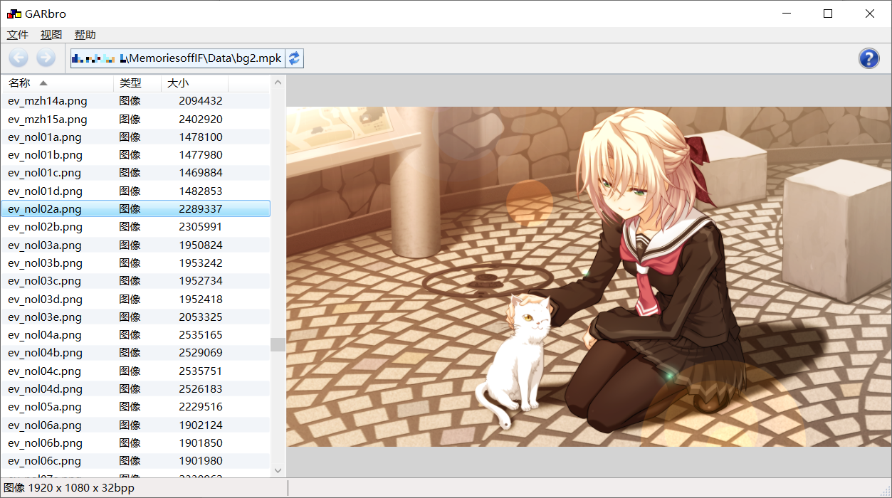  
ADX、HCA格式音频推荐使用VGMStream，可直接转换为WAV格式，或使用命令行进一步转换为其他格式。一般不会有问题，不需要密钥。也可以使用GARbro自带的解码功能，另有VGAudio、HCADecoder等工具备用。  
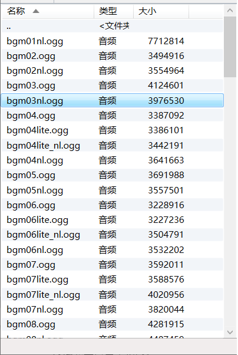  
USM格式视频推荐使用VGMToolBox的Misc. Tools/Stream Tools/Video Demultiplexer进行解封装，在Format选项选择对应的格式，获得视频流和音频流。音频流一般使用ADX、HCA格式，参考上文处理。视频流大多使用AVC编码，并被VGMToolBox使用m2v扩展名，且可能没有时间信息导致无法正常播放，需要使用MKVToolNix或FFMPEG等工具进行封装，然后可以正常播放。游戏SinMemo的视频使用了古老的MPEG-1编码，部分播放器可能无法播放，请尝试使用功能更强大的播放器，处理过程相同。另有工具WannaCRI可以解封装USM视频格式。  
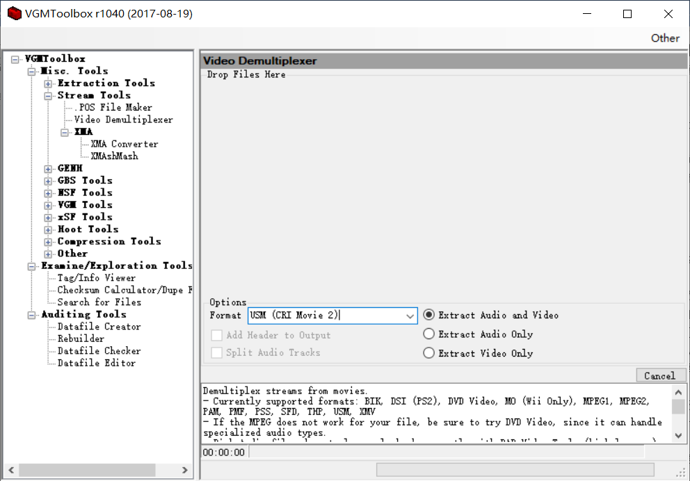  
bk2格式视频推荐使用BINKVideo的官方工具RADVideo观看和处理。  
加密的立绘分为lay格式和mvl格式两种，早期游戏使用lay格式，推荐使用ChaosChildPCTools处理。GARbro对lay格式的处理存在问题，不建议使用。mvl格式也可以使用ChaosChildPCTools处理，但无法直接得到最终成果，推荐使用mvl-preview处理。另有工具undice可以处理mvl格式，但速度较慢。  
有网友重置了此脚本。个人不对其功能和稳定性做保证。  
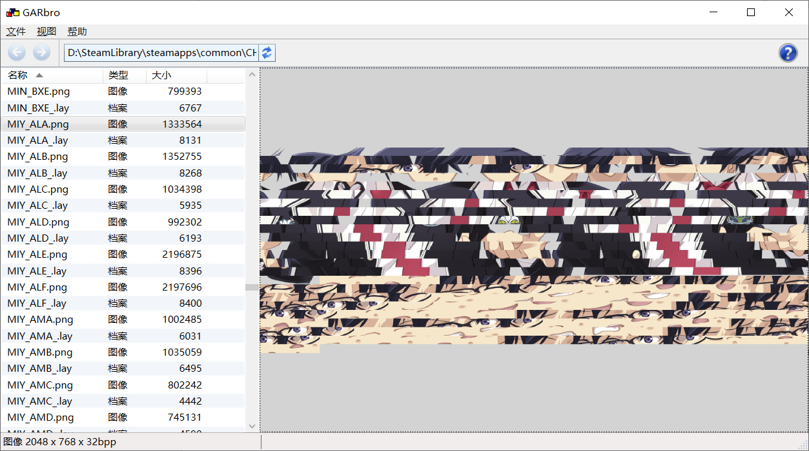  
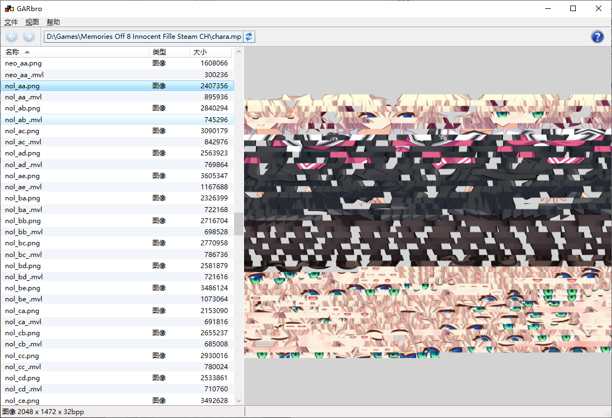  
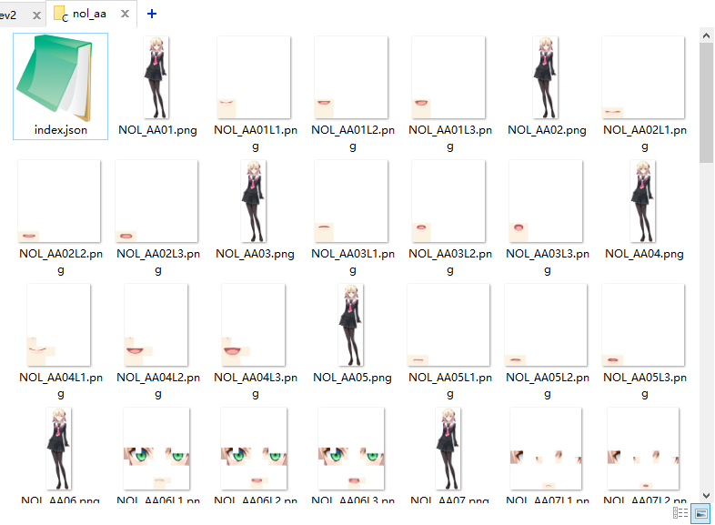  
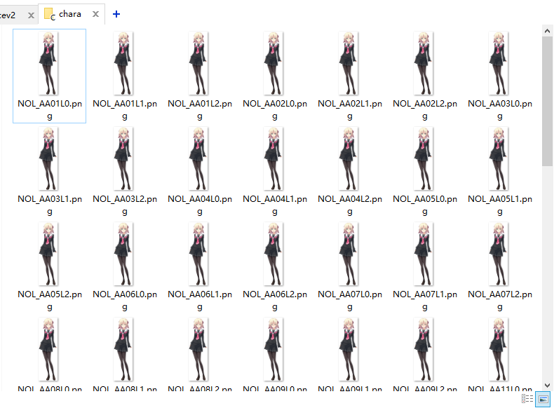  
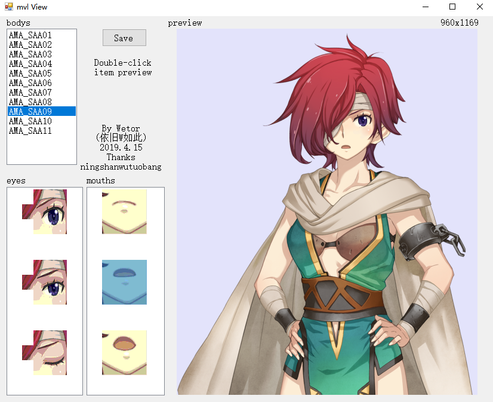  
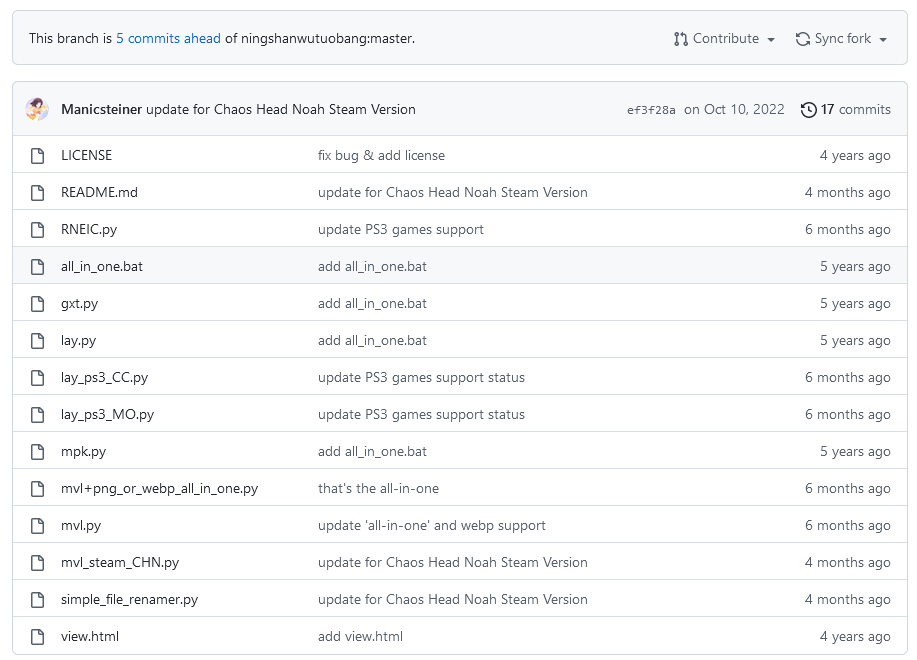  
  
[VGAudio|Github](https://github.com/Thealexbarney/VGAudio) 需要DotNet Framework 4.5.1  
[HCADecoder|Github](https://github.com/Nyagamon/HCADecoder)  
[WannaCRI|Github](https://github.com/donmai-me/WannaCRI/tree/0.3.0) 需要pip依赖 ffmpeg-python、python-json-logger，需要将FFMPEG、FFProbe添加至系统PATH变量  
[MKVToolNix](https://mkvtoolnix.download/downloads.html)  
[FFMPEG](https://ffmpeg.org/)  
[FFMPEG-Builds|Github](https://github.com/BtbN/FFmpeg-Builds)  
[RADVideo](http://www.radgametools.com/bnkdown.htm)  
[ChaosChildPCTools|Github](https://github.com/Manicsteiner/ChaosChildPCTools) 需要pip依赖 pillow 截至文章更新时，最高测试过 pillow 11.1.0 版本  
[ChaosChildPCTools-wangyw15|Github](https://github.com/wangyw15/ChaosChildPCTools) 当前版本(53fe761)需要Python3.12，需要pip依赖 pillow >=10.1.0，<=10.3.0 不保证其功能和稳定性  
[Mvl-Preview|Github](https://github.com/Manicsteiner/mvl_preview) 需要DotNet Framework 4.6.1 或 DotNet 6/7/8/9  
[undice|Github](https://github.com/AKAAkira/undice) 需要pip依赖 pillow  

## MAGES引擎次世代版-PC
主要游戏：混沌之脑（Steam、GOG版）（过渡），SinMemo（Steam版）（过渡），Ever17，Never7，秋回9  
特征：图片使用webp格式，视频使用webm格式封装，视频流使用VP9编码，音频流使用Vorbis编码。  
早期的混沌之脑图片使用WAV作为扩展名。视频使用USM格式，但没有扩展名。立绘使用mvl格式。压缩包内几乎所有文件使用纯数字命名。SinMemo则是图片使用PNG，视频使用webm格式。  
解包方案：与原版基本相同。其中使用webp格式的立绘图片在使用GARbro提取时请选择保持原样，由mvl-preview直接处理webp图片，否则可能出现奇怪的错误。  
混沌之脑的图片可使用批量重命名工具修改扩展名为webp后打开。如果在使用GARbro，可以尝试选中文件，右键选择文件类型为图片，然后刷新，可以预览图片。  
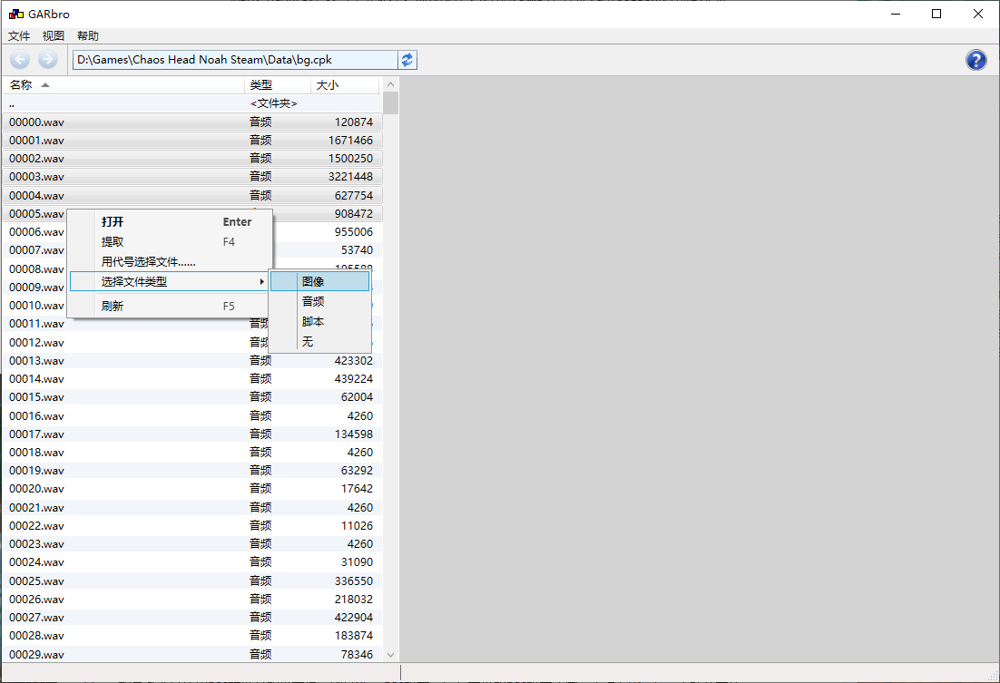  
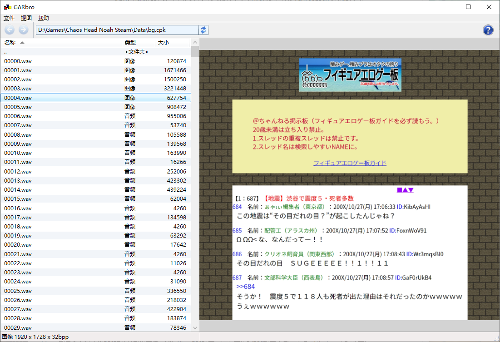  

## MAGES引擎早期版-xbox360
主要游戏：秋回6+FD（xbox360），秋回7（xbox360/旧PC），code18（xbox360），命运石之门系列（xbox360），混沌之脑LCC（xbox360），11eyes（xbox360）  
特征：压缩包命名与MAGES引擎相似，但使用dat扩展名，用HEXEditor类工具打开可看到文件头使用LNK4作为特征格式名。具体格式可能与MAGES引擎有较大差别。  
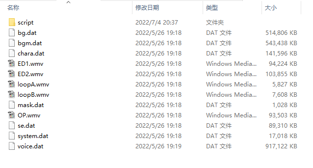  
解包方案：使用来自asmodean的工具exlnk4。具体内容不详，一般不会有问题。视频文件使用WMV格式，一般的播放器可以播放。  
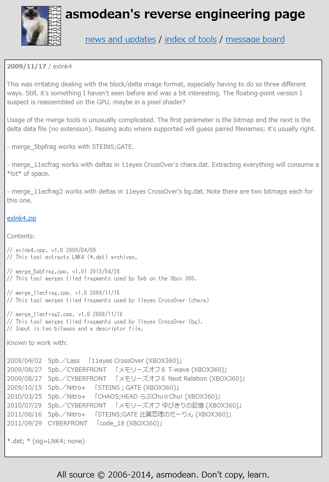
如果获取到的游戏使用unpacked/XEX/JTAG格式，那么可以直接看到XEX格式的可执行程序和压缩包，并进行解包。如果是其他格式，还需要将其转换为此格式。
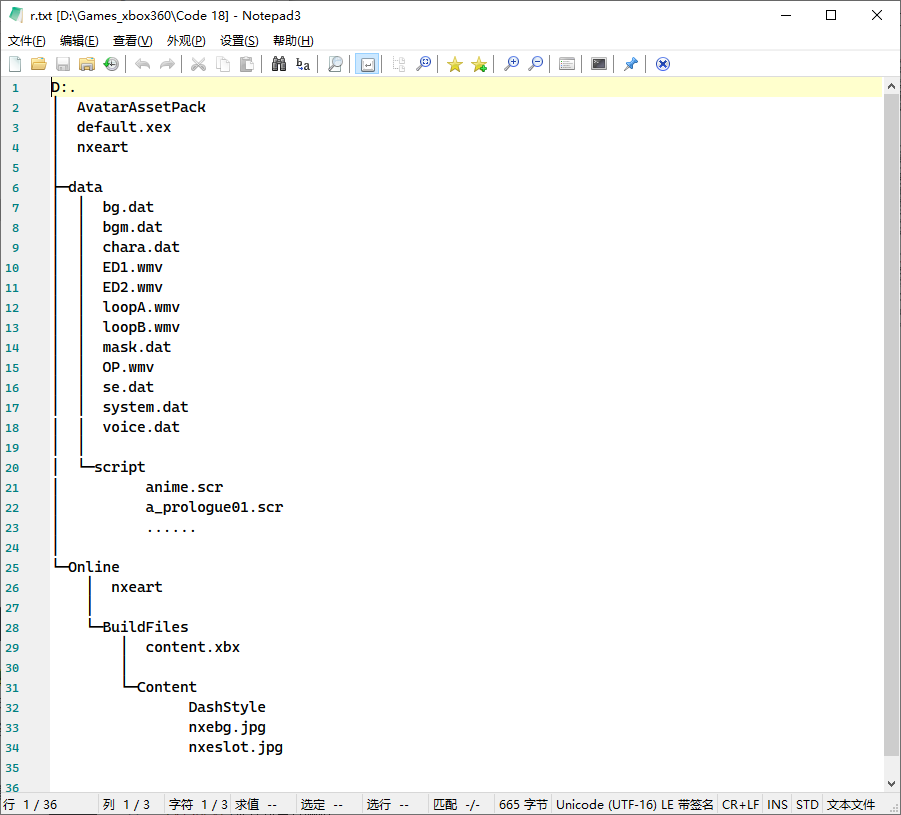  
如果游戏是使用ISO扩展名的单文件，则是XboxISO格式，应与常见的ISO格式不同，无法在Windows上挂载或使用一般解压缩软件解压缩，需要使用工具Xbox360 ISO Extract解压缩转换为unpacked格式，或使用VGMToolBox的Misc. Tools/Extraction Tools/Generic/ISO-Archive Extractor预览和提取。如果文件大小在7.29GB左右，可以猜测该文件为Redump标准的ISO文件，转换过程不会有问题。关于Redump的具体信息可以在redump.org查询。如果文件明显小于7GB，则可能是重构的ISO文件，可能因重构过程中出现错误而无法转换。如遇到此问题请尝试寻找其他格式的版本。
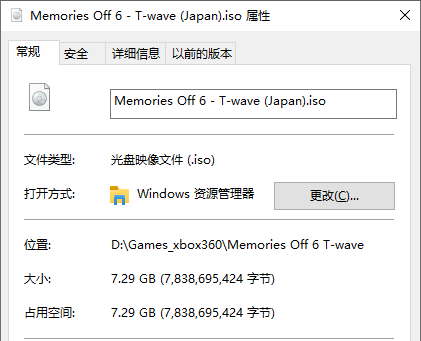  
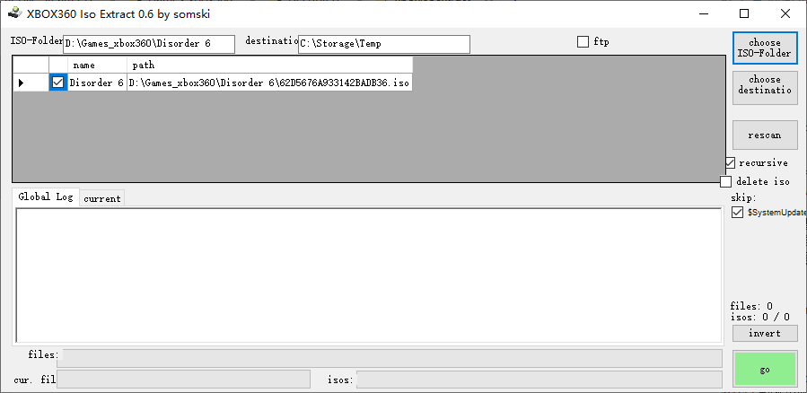  
如果游戏使用无格式的字母、数字字符串文件作为可执行文件，且相邻的data目录下的文件全部为明显类似分卷压缩的同大小无格式文件，那么该游戏版本为GOD格式。可使用工具God2iso转换为重构ISO，再转换为unpacked。此过程可能因重构过程中出现错误而无法转换。已知游戏Dunamis15在网络上流传的GOD格式版本必定有此问题。  
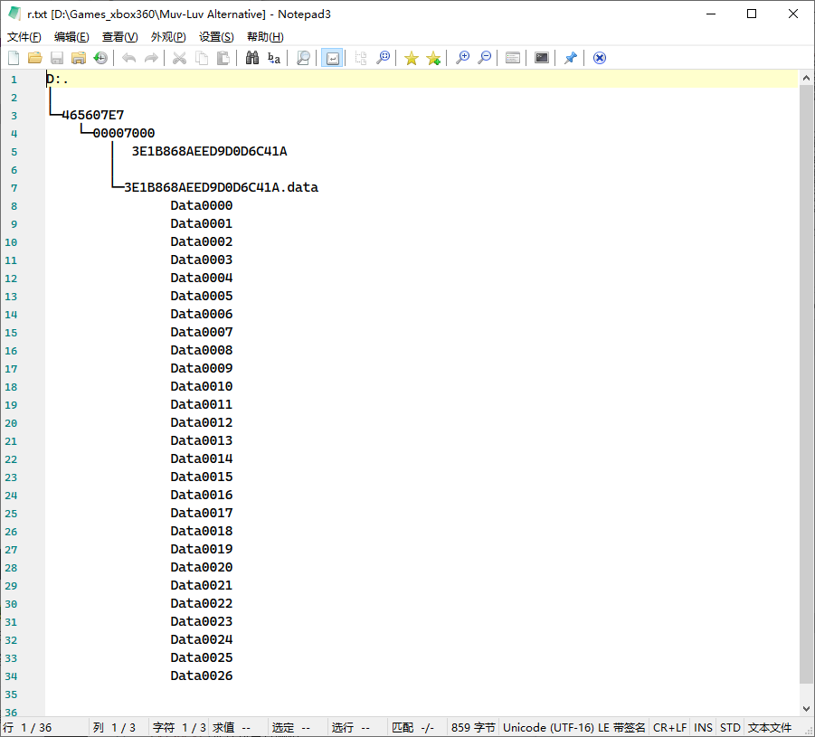  
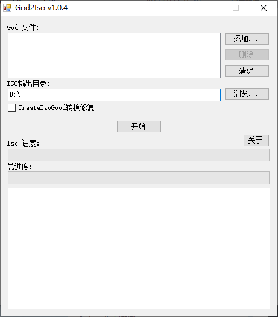  
  
[exlnk4|asmodean](http://asmodean.reverse.net/pages/exlnk4.html) 该工具可能需要使用VCRedist-2012，需要另行安装  
[Xbox360 ISO Extract]未找到官方网站  
[God2Iso|Github](https://github.com/raburton/god2iso) 无官方构建版  

## MAGES引擎-PS3
主要游戏：混沌之子（PS3），命运石之门0（PS3）  
特征：与PC版基本相同。lay文件使用BigEndian编码。视频使用USM封装。  
解包方案：沿用PC版方案。处理lay文件时请使用ChaosChildPCTools中单独的PS3版脚本。  
PS3平台的游戏分享大多使用unpacked形式，即直接暴露所有文件，也称JB-Folder格式，不需要额外的预处理。  
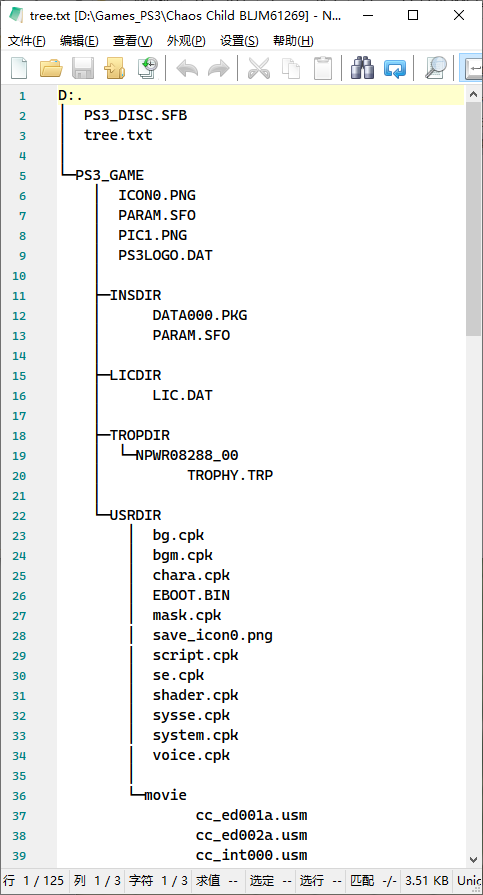  
命运石之门0 PS3汉化版常见ISO格式的分享，使用了ISO-Decrypted格式，使用7-Zip当作压缩包解压缩即可。  
网络上还流传有一些ISO-Redump标准的ISO格式分享，与解密版对应，称为ISO-Encrypted格式，对USDIR目录下的文件进行了加密，与解密版在文件大小上没有区别，甚至也可以直接使用7-Zip解压缩，但解压缩得到的文件无法正常读取。两者只有通过对比文件哈希值或解压缩后查看文件时才能看出区别。两种ISO格式可通过工具PS3Dec转换，并需要密钥。密钥可在redump.org的ISO对应页面得到。  
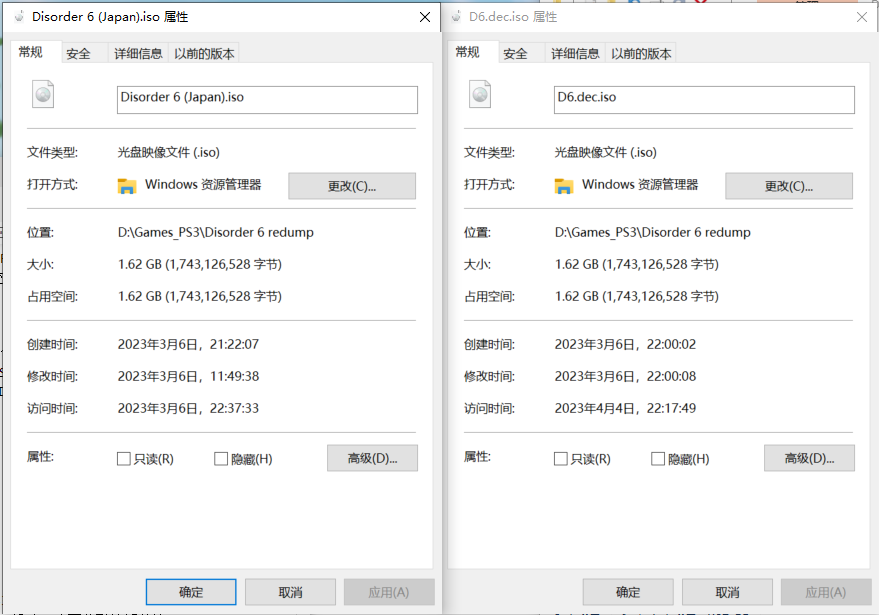  
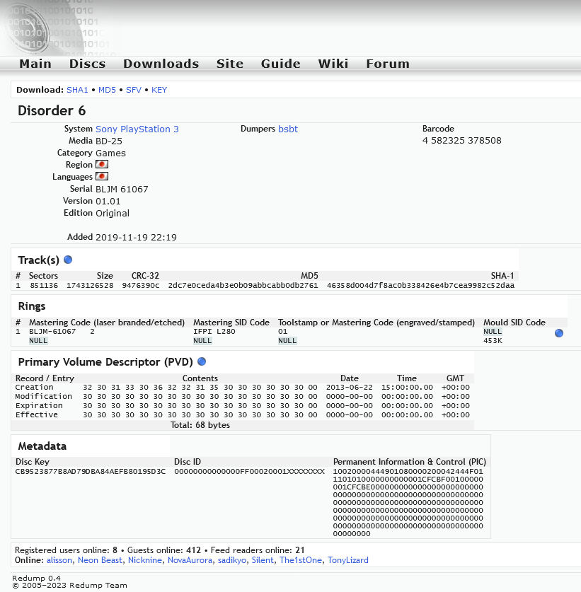  

[PS3Dec|Github](https://github.com/creative-username-ggn/PS3Dec)  

## MAGES引擎早期版-PS3
主要游戏：秋回6+FD（PS3），秋回7+FD（PS3），混沌之脑LCC（PS3），命运石之门系列（PS3），花咲くまにまに（PS3），机器人笔记（PS3）  
特征：图片为无格式无压缩点阵图，音频为ADX格式但没有扩展名，视频使用SFD封装，MPEG-1或MPEG-2编码。lay文件使用BigEndian编码。压缩包内几乎所有文件使用纯数字命名。  
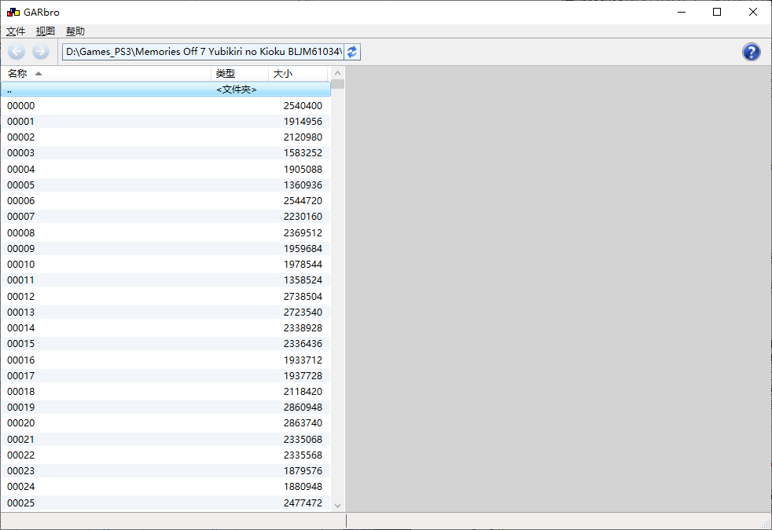  
解包方案：基本沿用PC版方案。  
图片可使用RNE Image Conventer转换为常见格式，或使用我个人维护版本的GARbro，选择文件格式为图片进行预览。音频可添加.adx后缀后使用VGMStream转换为常见格式。SFD视频可使用VGMToolBox解封装，后续处理相同。处理无后缀名的lay文件时请使用单独的PS3版脚本，其中偶数号的文件是图片，奇数号的是lay文件。SG Phenogram的立绘文件似乎有一点问题，无法正确解析，请使用其他平台的版本。  
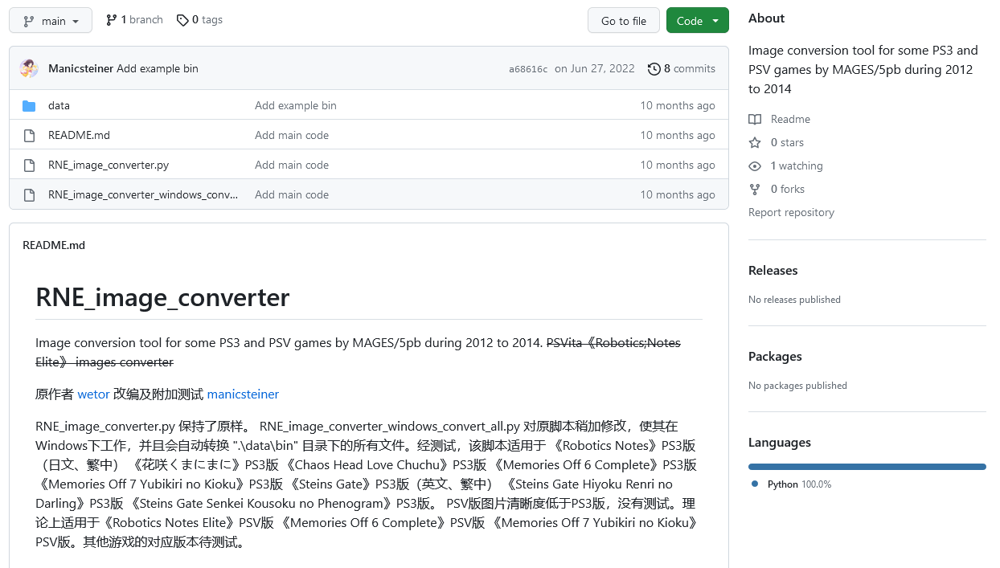  

[RNE Image Conventer|Github](https://github.com/Manicsteiner/RNE_image_converter) 需要pip依赖 pillow  

## MAGES引擎-PSV
主要游戏：命运石之门精英版（PSV），春物续（PSV），混沌之子+LCC（PSV），SG0（PSV），Yu-No 2017版（PSV），秋回8+FD（PSV）  
特征：封装与PC版基本相同。图片使用gxt格式，视频使用MP4封装的AVC编码，音频使用索尼自制的at9格式。  
解包方案：基本沿用PC版方案。  
图片可ChaosChildPCTools中的gxt.py转换为常见格式。音频可使用VGMStream转换为常见格式。立绘使用ChaosChildPCTools处理。  
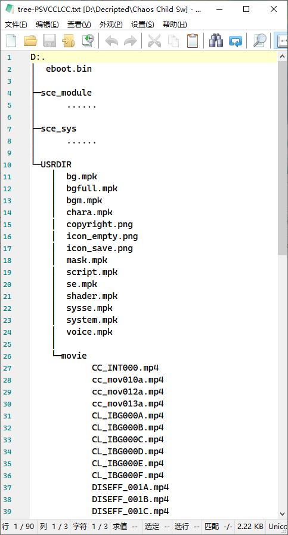  
PSV平台的游戏分享有各种格式，常见的有MaiDump，NoNpDrm，VPK，PKG等，其中MaiDump格式在Windows环境下可以直接提取；NoNpDrm格式可以看到文件但无法正常读取；VPK格式为zip格式封装的压缩包，具体情况与提取格式有关；PKG格式可使用配置好的Vita3k模拟器以及PKG配套的密钥提取其内容。  
NoNpDrm格式的游戏如果使用zip格式的压缩包，可以尝试使用配置好的Vita3k模拟器导入游戏，在此过程中解密，得到正常的文件。此过程要求该包中没有使用psarc，压缩包格式必须为zip，可能还要求是zip-Deflate，其他压缩格式请尝试解压缩后重新压缩成zip-Deflate，符合以上要求才可能成功。  

## MAGES引擎早期版-PSV
主要游戏：秋回6+FD（PSV），秋回7+FD（PSV），命运石之门（PSV），SG比翼（PSV），机器人笔记精英版（PSV），SG表征图（PSV），春物（PSV）  
特征：与PS3同时期的早期版相似，图片为无格式无压缩点阵图，音乐音频为无格式的索尼自制的ac9格式，且可能使用其他扩展名，语音音频使用hca格式，视频使用usm格式。实际上还可能有一些旧版和标准版混合的情况。  
解包方案：图片可ChaosChildPCTools中的gxt.py转换为常见格式。音频可使用VGMStream转换为常见格式。立绘使用ChaosChildPCTools处理，具体是否可用未测试。  
此外还有几个游戏的音频所在压缩包使用了类似BGM_AT9.MPK的命名，此类游戏的MPK压缩包使用了不同的索引，无法用旧版GARbro解析，如需要解包可以使用Crskycode版本或我个人维护版本的GARbro，或使用ChaosChildPCTools的mpk.py处理，或直接选择其他平台的版本。  

## MAGES引擎-PS4
主要游戏：？  
特征：？  
解包方案：目前PS4的游戏资源还是太少了，不足以支持论证。  
常见PKG格式分享，可以使用工具PS4-PKG-Tool解包为unpacked形式。过程需要密钥，官方的PKG密钥常为全0或全1。或者使用shadps4模拟器v0.7.0及以前的版本，选择安装PKG来解包，并且似乎不需要密钥。但是此后版本的shadps4模拟器移除了安装PKG功能。得到的文件可按PC版或Switch版的方案处理。  
使用PS4-PKG-Tool时还需要下载PS4-Fake-PKG-Tools的全部文件，放置于同一文件夹下。  
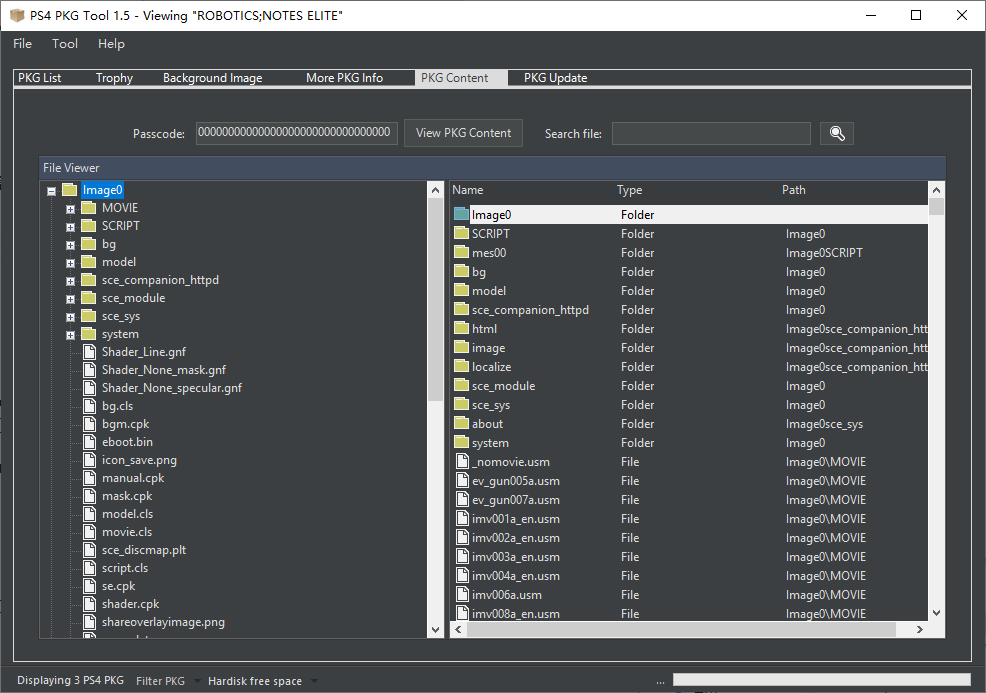

[PS4-PKG-Tool|Github](https://github.com/pearlxcore/PS4-PKG-Tool) 旧版需要DotNet Framework 4.7.2，新版需要DotNet 7  
[PS4-Fake-PKG-Tools|Github](https://github.com/CyB1K/PS4-Fake-PKG-Tools-3.87)  
[shadps4|Github](https://github.com/shadps4-emu/shadps4)  

## MAGES引擎-Switch
主要游戏：命运石之门系列，Yu-No 2017版，秋回系列，机器人笔记+FD，SinMemo（过渡）  
特征：与PC版基本相同，图片使用常见格式，音频使用HCA格式，视频使用USM格式封装，立绘图片使用mvl格式。封包使用cpk、mpk格式，但更常见直接使用文件夹，用同名cls文件记录其中的文件名。  
解包方案：与PC版基本相同，没有额外的问题。  
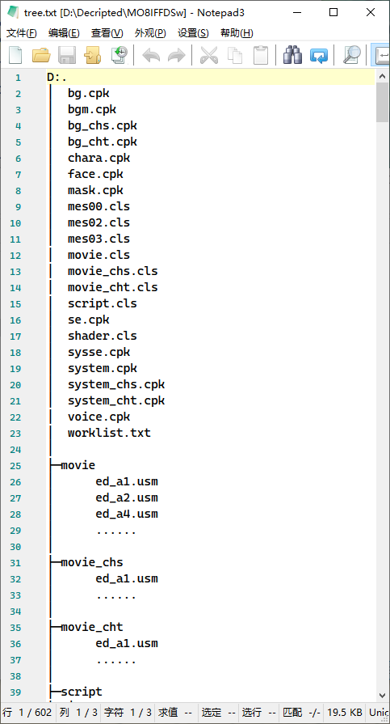  
Switch平台使用NSP、XCI格式存储游戏内容，一般NSP格式来自线上商店，一个NSP文件只能封装一份程序（主程序、更新包），XCI格式来自卡带，可以封装多个NSP文件，甚至可以封装多个游戏。两者之间可以通过工具NSC_Builder转换，可以看作没有区别。有时游戏分享者会使用NSZ、XCZ格式分享游戏，这种格式是民间研究的NSP、XCI格式的压缩版本，可使用NSC_Builder还原为对应格式。  
NSP文件下封装的是NCA文件，可使用工具XCI-Explorer查看结构并提取NCA，再用SwitchExplorer打开NCA文件得到PC版类似的cpk等文件……老方法是这样的，对还原修改后的游戏有帮助，但只是提取没必要这么麻烦。  
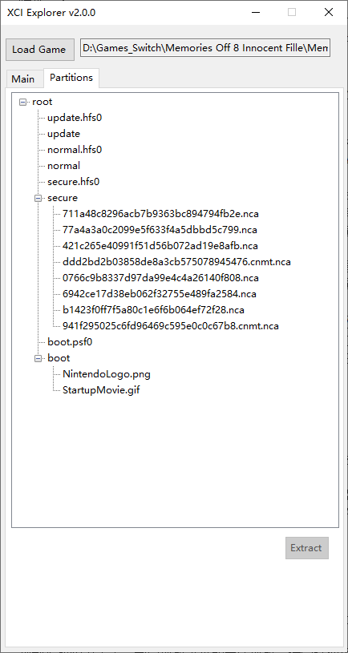  
众所周知，Switch现在有两个模拟器yuzu和Ryujinx，只要在配置好的模拟器里右键选择扫描到的NSP、XCI文件，选择Extract，就能得到需要的文件。  
以上工具均需要Switch密钥，模拟器除密钥外还需要系统固件，请自行获取。  

[NSC_Builder|Github](https://github.com/zdm65477730/NSC_BUILDER)  
[XCI-Explorer|Github](https://github.com/StudentBlake/XCI-Explorer) 需要DotNet 6，其他分支的版本可以使用DotNet 7/8  
[SwitchExplorer|Github](https://github.com/simontime/SwitchExplorer) 需要DotNet Framework 4.6.1  
[yuzu](https://yuzu-emu.org/) 需要VCRedist2015+  
[Ryujinx](https://ryujinx.org/) 最新版需要DotNet 8  

## MAGES引擎次世代版-Switch
主要游戏：SinMemo（过渡），混沌系列，春物，Ever17，Never7，秋回9  
特征：与旧版相比，几乎不再使用cpk、mpk封包而是使用文件夹和cls文件，图片（除SinMemo）使用webp格式，音频使用ns-opus格式，视频使用webm格式封装，视频流使用VP8、VP9编码，音频流使用Vorbis编码。  
解包方案：与PC版基本相同。webm格式的视频需要功能较强的播放器播放。ns-opus格式的音频使用.opus作为扩展名，但使用了专有的文件头，与常见的ogg-opus格式不同，无法使用一般的播放器播放。需要使用VGMStream转码。而且使用VGMStream的fb2k插件也无法直接播放，需要将扩展名改为.lopus才能由插件解码。  
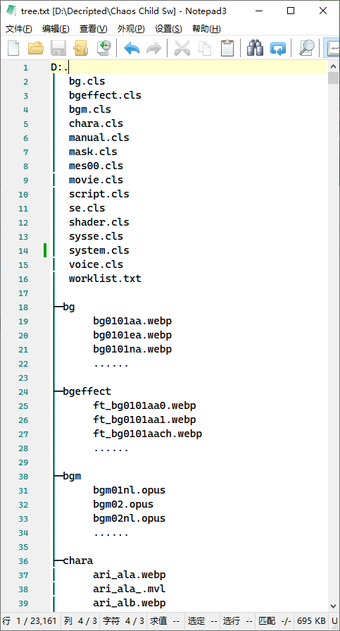  

## rUGP引擎
主要游戏：Disorder6（xbox360/PS3），解放少女SIN（PS3/PSV），混沌之脑Noah（PS3/PSV）  
特征：游戏内容除视频外，几乎全部文件体积集中在一个RIO格式文件上。PS3版视频使用AVI封装，MPEG-4视频编码、MP3音频编码。  
解包方案：没有太好的方案。这个引擎的PC版被称为最难对付的ADV游戏引擎之一，只有几个针对age社PC版游戏的工具。  
经测试，工具RioX可以处理游戏Disorder6两个版本和解放少女SIN的PS3版，得到背景图、EVCG和一些文本内容，无法得到音频和角色立绘。PSV版的相关游戏无法正确处理，建议使用其他平台的版本。工具RioX已经长时间未更新，且未开源。
视频编码较为古老，部分播放器可能无法播放，请尝试使用功能更强大的播放器。  
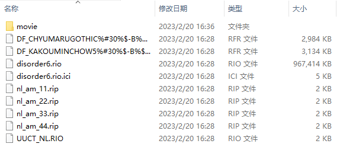  
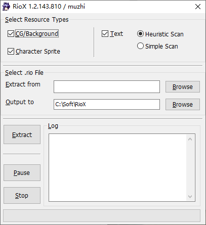  

[RioX|archive](https://web.archive.org/web/20220809055557/http://riox.thisillusion.org/) 原网页已消失  

## M2/E-mote/KaledoADV引擎
主要游戏：Dunamis15（xbox360/PS3），Infinite Stratos系列（PS3/PSV），可塑性记忆（PSV），超自然九人组，五等分系列，匿名代码  
特征：文件包使用_body.bin+_info.psb.m封包，视频使用对应平台常见格式。  
解包方案：来自asmodean的exm2lib给出了早期两个游戏的解包方法，但没有后续更新。  
现在推荐使用工具FreeMote。这是一个面向Emote相关各类封包格式的工具，支持KaledoADV引擎的封包。每一个游戏的封包都使用了不同的密钥，PSV版的游戏可用文本编辑器或HexEditor打开eboot.bin，在其中首次出现的"script_info.psb.m"前找到，PC版的在exe文件中同样位置。Switch版密钥位置不固定，请尝试用Ryujinx提取ExeFS，用KaleidoKeyFinderSwitch处理main文件，在所有可能是密钥的字符串中尝试。PSV、PC版也可使用此工具，但效率低下且不如直接查找直观。PS3平台的密钥获取方法稍复杂，您需要安装并配置好RPCS3模拟器，在工具栏选择 Utilities-Decrypt PS3 Binaries，选择对应游戏的 EBOOT.BIN 文件，解密得到一个 EBOOT.elf 文件，然后可以按类似PSV版的方法，在"script_info.psb.m"等一系列文件名前找到。Xbox360平台不适用此方法，但此版本的游戏通常与同时发售的PS3版使用相同的密钥，可以碰碰运气。  
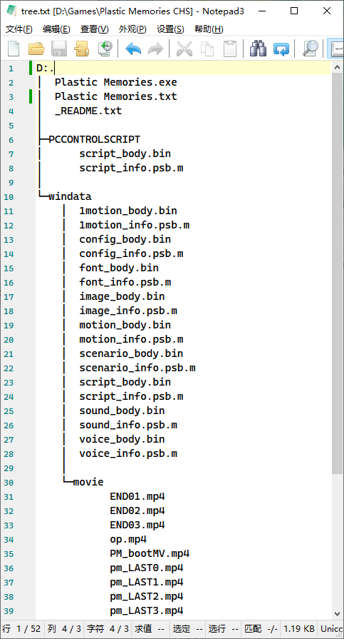  
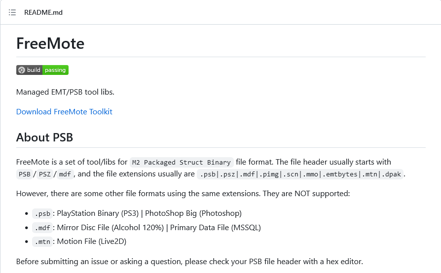  
匿名代码PC Steam版的视频文件使用了mzv格式后缀名，实际上是文件头有问题的MP4文件，修改文件头前四个字节后改为mp4后缀即可正常播放。  
目前已经发现其中有至少三种MP4格式，需要修改为不同的值。  
文件固定开头为00~03位为00，04~07位为ftyp，再后面一段到moov或mdat之前是MP4封装格式。例如mormal_end.mzv的封装格式为mp42 (mp42/mp41) ，所以将第03位的00修改为0x18，即可正常播放。对应关系如下，需要严格对应每一个关键字。  
 - 0x18 mp42 (mp42/mp41)   
 - 0x1C mp42 (mp42/mp41/isom)   
 - 0x28 M4V  (M4V /M4A /mp42/mp41/isom/avc1)   

未出现但可能用到的对应关系  
 - 0x14 isom (isom)  
 - 0x1C isom (isom/iso2/mp41)  
 - 0x1C mp42 (mp42/isom/avc1)  
 - 0x1C mp42 (mp42/iso2/mp41)  
 - 0x20 mp42 (mp42/iso2/avc1/mp41)  
 - 0x20 isom (isom/iso2/avc1/mp41)  

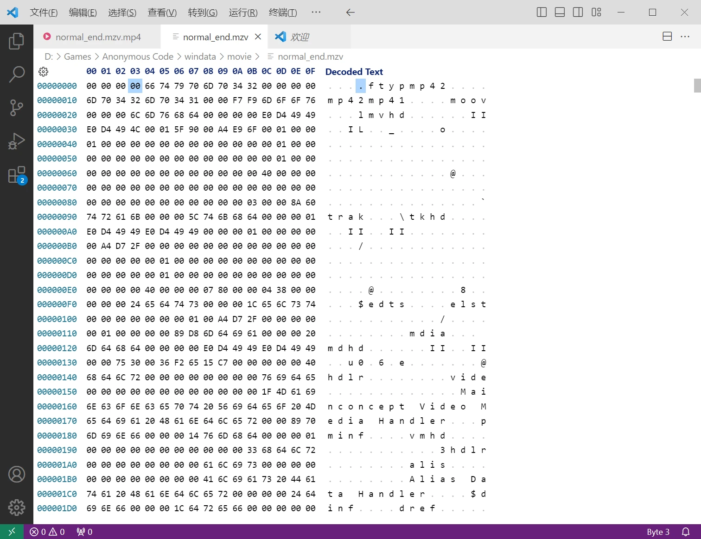  
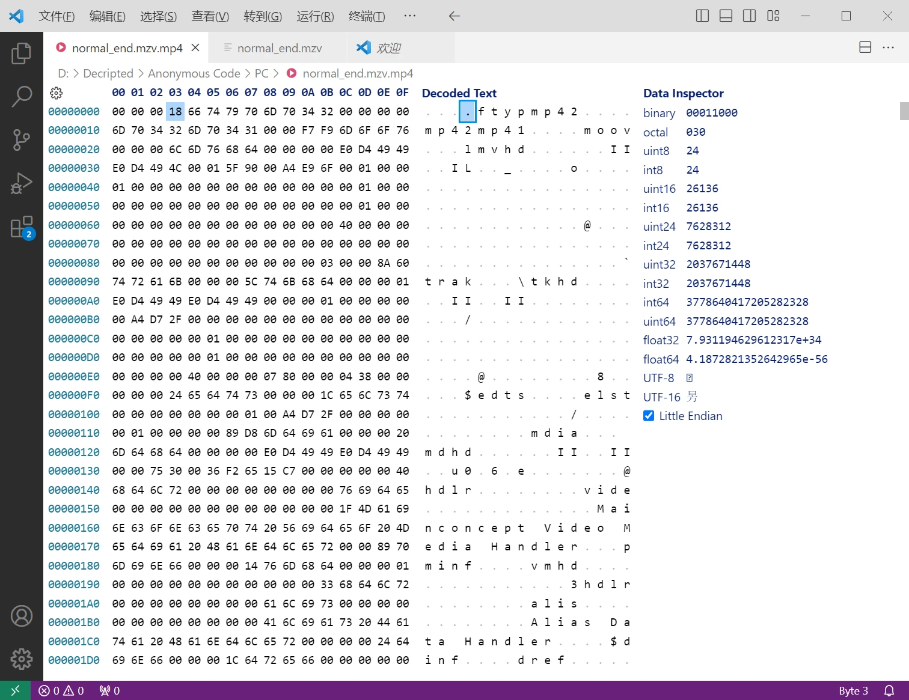  
PS3平台的视频使用了PAM封装，可用VGMToolBox解封装。另Infinite Stratos系列PS3版的视频的音频轨使用了GENH格式，用VGMToolBox解封装会得到视频轨文件、一个genh文件和一个lpcm文件并报错，此时需要用ShinHayarigamiExt中的GENH_comb.py将genh和lpcm拼装成一个文件或手动拼装，然后用VGMStream播放或转码。（或者使用我编译的VGMToolBox，原开发者在代码上修复了这个问题但没有发布程序）  

[exm2lib|asmodean](http://asmodean.reverse.net/pages/exm2lib.html) 该工具可能需要使用VCRedist-2012，需要另行安装  
[FreeMote|Github](https://github.com/UlyssesWu/FreeMote) 需要DotNet Framework 4.8  
[KaleidoKeyFinderSwitch|Github](https://github.com/Manicsteiner/KaleidoKeyFinderSwitch)  
[ShinhayarigamiExt|Github](https://github.com/Manicsteiner/ShinHayarigamiExt)  

## Unity引擎
主要游戏：この素晴らしい世界に祝福を！ ～この欲望の衣装に寵愛を！～（Switch）  
特征：Data目录下有Managed、Resources、StreamingAssets文件夹，有boot.config、resources.assets等文件，一般StreamingAssets文件夹体积最大。  
解包方案：使用通用工具AssetStudio。不同的Unity游戏、不同平台间的差异可能很大，且可能有加密，请自行研究。  
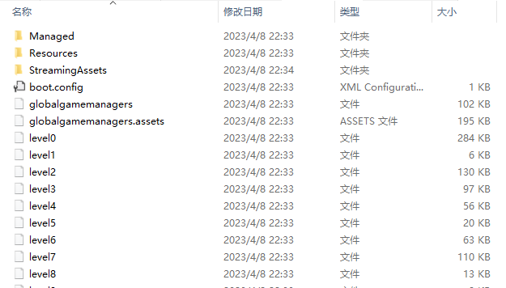  
[AssetStudio|Github](https://github.com/Perfare/AssetStudio) 需要DotNet Framework 4.7.2 或 DotNet 5/6  
AssetStudio原版已长时间未更新，推荐两个有少量更新维护的版本。  
[AssetStudio-zhangjiequan|Github](https://github.com/zhangjiequan/AssetStudio) 需要DotNet Framework 4.7.2 或 DotNet 5/6  
[AssetStudio-aelurum|Github](https://github.com/aelurum/AssetStudio) 需要DotNet Framework 4.7.2 或 DotNet 6/8/9  

## Unity引擎+CRIWare封包
主要游戏：Yuru Camp Have a Nice Day（Switch），Summer Time Render Another Horizon（Switch）  
特征：与Unity引擎相同，但StreamingAssets目录下许多文件使用了CRIWare的专有格式，如CPK、USM、AWB、ACB。图片文件没有扩展名，视频使用USM封装，且音频轨道使用了加密文件头的HCA格式。  
解包方案：首先使用GARBro打开cpk格式的封包。  
此类游戏的AWB、ACB文件更改了索引，VGMtoolBox无法正确处理，请使用VGMStream处理，得到一大堆音频。  
USM文件可用VGMToolBox解封装，得到正常的视频轨和bin格式的音频轨。将音频轨的扩展名更改为hca，然后用VGMStream播放或转码。WannaCRI无法正确处理音频轨。  
texbg和texeg的没有扩展名的图片文件实际上是DXT1编码的DDS格式图片，但缺少文件头，需要添加正确的文件头后才能打开查看。此时得到的图片是旋转过180度的，还要再旋转回来。这些问题可能是来自于Unity引擎的一些特性。以上处理过程可以使用工具YuruCampHeaderAdder处理。其他几个图片包的图片使用了DXT5编码，在热心网友的帮助下也已经可以处理。  
[YuruCampHeaderAdder|Github](https://github.com/Manicsteiner/YuruCampHeaderAdder) 需要pip依赖 pillow  

## Unity引擎+未知封包
主要游戏：幻想マネージュ（Switch），心灵判官：无法抉择的幸福（PC）  
特征：有Unity引擎的一些特征，前者使用QPK格式封包，后者使用CPK格式封包。  
解包方案：幻想マネージュ（Switch）：QPK文件似乎可以由最新版的GARbro处理，双击DATA\#00002打开，其中的bg按文件夹打开，可以查看其中的图片文件。记得按顺序从上到下打开各个文件，否则有可能报错。  后者与前面的CRIWare封包相同，但内容上有很大差别，将大多数内容放在一个包里，图片没有复杂处理。  

## PS2平台多引擎汇总
PS2平台游戏很多，引擎种类也很多，不太方便一一列举，此处只有引擎信息，具体游戏请查看在线表格，或自行分析。  
主要推荐使用 PS2VNTool 处理这些游戏，该工具需要自行选择游戏名称来选择处理方案。另一些游戏推荐使用Crskycode版本或我个人编译版本的GARbro。在使用GARbro处理此类游戏时，如果遇到全部图片都是半透明的情况或应当透明的部分为黑色，请在 视图-偏好设置-TIM2设置中修改图片透明度格式。  
[PS2VNTool|Github](https://github.com/punk7890/PS2-Visual-Novel-Tool)  

PS2平台的视频文件通常有两种，一种是CRIWare的SFD格式，音频轨通常为ADX格式，另一种是PS2原生的PSS格式，音频轨为SS2格式，视频轨均为MPEG-1/2格式。两者均可以使用VGMtoolBox解封装，由VGMStream转码音频。  

### KID/Regista SPC
SPC格式图片，使用lzss stream压缩，其中的内容为LBG作为标签的图片格式，可以使用GARbro处理。PS2VNTool的处理似乎有问题。音频为ADX格式。  
### KID/Regista BIP
BIP格式图片，使用lzss stream压缩，其中的内容没有格式标识，已由GARbro支持。但是CHARA没有支持。音频为ADX格式。  
### KID/Regista BIP 256色
BIP格式图片，使用lzss stream压缩，其中的内容没有格式标识，尝试由GARbro支持，但是效果还是有些奇怪，不确定是否已正确处理。  
### KID/5pb KLZ
KLZ格式图片，压缩方法不明（被称为lzh），其中的内容为TIM2图片格式。当前由GARbro测试版或PS2VNTool支持。音频为ADX格式。  
### Princess Soft Zerosystem-PACs
TIM2格式图片。PAC包可由GARbro处理。BGM音频为VGS-Princess Soft Header，可由VGMStream处理，SE和Voice为HBD格式，VGMStream正尝试支持此格式，可能存在问题。  
### Princess Soft Zerosystem-PACBIN
TIM2格式或LZS压缩的TIM2格式图片，压缩在一个巨大的PAC.BIN中，文件名列表信息在SLPM可执行文件中，PS2VNTool支持。BGM音频为VGS-Princess Soft Header，可由VGMStream处理，SE和Voice为HBD格式，VGMStream正尝试支持此格式，可能存在问题。  
### KID/5pb MAGESv1
DAT压缩包，使用CPS格式压缩图片，具体格式不确定。其中一些游戏对CPS文件进行了额外加密。PS2VNTool支持。  
### KID ogdt
音频在AFS压缩包中，ADX格式，图片为ogdt header，目前不能处理。  

## KID旧作中文PC移植版
由娱乐通、英特、光谱等发行的旧PC版，使用HAC封包、HGP图片格式，个人没研究过，只直接推荐工具，有问题请去问原维护者。  

DeHAC 和 HgpViewer 很多年前从某论坛流出的软件，只支持较旧的游戏，没有源代码  
[CNGALTools|Github](https://github.com/YeLikesss/CNGALTools) 需要 DotNet 6 自行编译  

## 工具维护状态
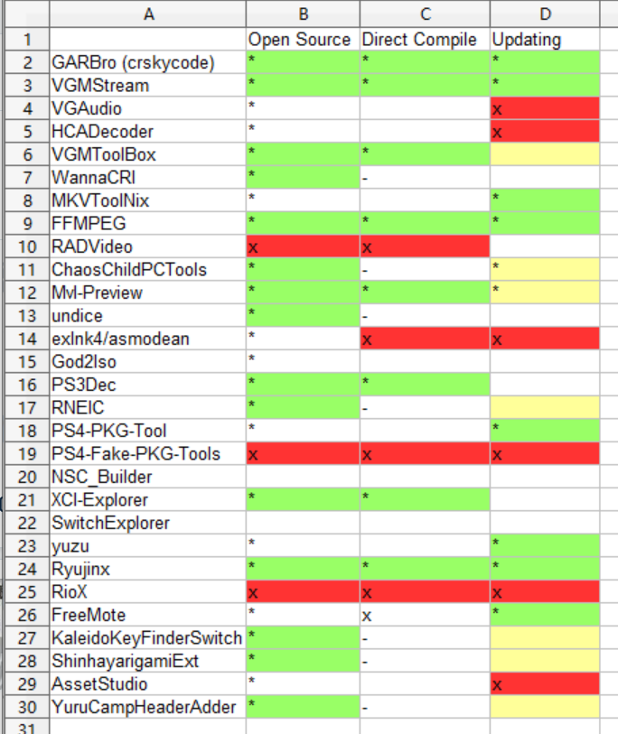
__本段内容待更新__
左侧为工具名称，第一列表示是否开源，第二列表示是否可在本地直接编译（包含是否可获取依赖项、是否兼容最新开发环境，python不计入），第三列表示是否有人在维护（黄色为我在尝试维护）。星号代表是，X代表否，绿色和红色代表已确认，白底和空白代表未确认。  
对于三红了的工具，意味着完全无法维护，遇到了新问题只能问神仙了。  

__图片链接待更新__